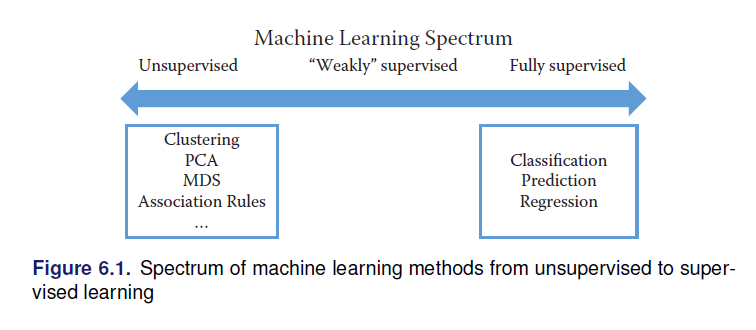
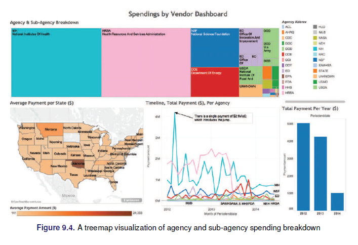
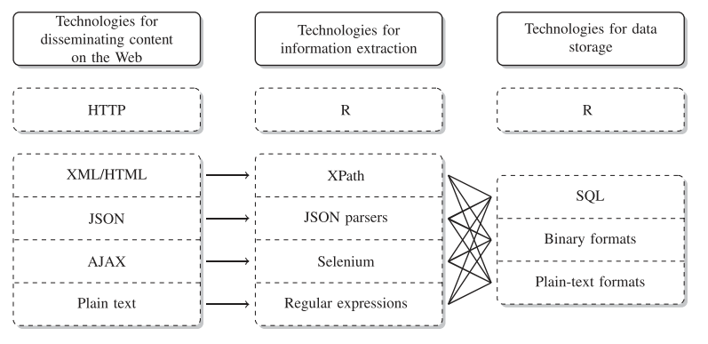

```{r setup, include=FALSE}
knitr::opts_chunk$set(echo = TRUE, eval = F)
```

## Conceptos y terminología
  
  - Datasets: Colección de datos, comparte el mismo conjunto de atributos o propiedades 
  - Análisis de datos: El análisis de datos es el proceso de examinar datos para encontrar hechos, relaciones, patrones, ideas y/o tendencias. El objetivo general del análisis de datos es apoyar una mejor toma de decisiones.

> Actividad 1

Para las siguientes áreas explore e identifique posibles datasets y algunos objetivos para el análisis de datos:

  + Banca
  + Salud
  + Educación
  + Telecomunicaciones
  + Agricultura
  + Comercio exterior
  
Explore si existen datos abiertos en Bolivia respecto su respuesta.

## Analítica de datos

La analítica de datos es un término más amplio, incluye la gestión del ciclo de vida completo de los datos, que abarca la recopilación, limpieza, organización, almacenamiento, análisis. El término incluye el desarrollo de métodos de análisis, técnicas científicas y
herramientas. 

+ En entornos orientados a los negocios, los resultados de la analítica de datos pueden reducir los costos operativos y facilitar la toma de decisiones estratégicas.
+ En las ciencias, la analítica de datos puede ayudar a identificar la causa de un fenómeno para mejorar la precisión de las predicciones.
+ En entornos basados en servicios como las organizaciones del sector público, puede ayudar a fortalecer el enfoque en la prestación de servicios de alta calidad mediante la reducción de costos.


  + Valor: Compresión en retrospectiva, conocimiento/percepción, previsión 
  + Complejidad: Baja, media, alta

### Análisis descriptivo

El análisis descriptivo se lleva a cabo para **responder preguntas sobre eventos que ya han ocurrió**. Esta forma de análisis **contextualiza** los datos para generar información. 

  - Estadística descriptiva
  - Inferencia descriptiva

### Análisis de diagnóstico

El análisis diagnóstico tiene como objetivo determinar la **causa** de un fenómeno que **ocurrió en el pasado**. usando preguntas que se enfocan en la razón detrás del evento. El objetivo de este tipo de análisis es determinar **qué información está relacionada con el fenómeno** para permitir responder preguntas que buscan determinar por qué ha ocurrido algo.

### Análisis predictivo

El análisis predictivo se lleva a cabo en un intento de determinar el **resultado de un evento que podría ocurrir en el futuro**. Con el análisis predictivo, la información se mejora con significado generar conocimiento que transmita cómo se relaciona esa información. La fuerza y magnitud de las asociaciones forman la base de los modelos que se utilizan para generar futuros predicciones basadas en eventos pasados. Es importante entender que los **modelos utilizados para el análisis predictivo tiene dependencias implícitas** en la condiciones bajo las cuales el pasado ocurrieron los hechos. Si estas condiciones subyacentes cambian, entonces los modelos que hacen predicciones necesitan ser actualizadas.

  + Inferencia predictiva
  + Inferencia causal

### Análisis prescriptivo

El análisis prescriptivo se **basa en los resultados del análisis predictivo** al prescribir acciones que se deben tomar. El enfoque no es solo en qué opción prescrita es mejor seguir. En otras palabras, el análisis prescriptivo proporciona resultados sobre los que se puede razonar, porque incorporan elementos de comprensión situacional. Por lo tanto, este tipo de análisis puede utilizarse para obtener una ventaja o mitigar un riesgo.

> Actividad 2

Determinar el tipo de análisis que se requiere en las siguientes solicitudes:

  - El INRA quiere conocer el efecto que tiene la titulación de tierras sobre los ingresos de los productores agropecuarios. 
  - UNICEF quiere conocer el nivel de pobreza que existe en los hogares con NNA y los factores que explican estos resultados. 
  - UNFPA quiere saber el efecto que tuvo sus campañas de violencia que realizó en las universidades públicas del país 
  - KAS quiere conocer los valores democráticos de los jóvenes 
  - OIM quiere saber que tipos de mensajes de empleo están vinculados a trata y tráfico para monitorear 

## Minería de datos

Es el análisis de **conjuntos de datos** (a menudo grandes) para encontrar **relaciones insospechadas** (conocimiento) y resumir los datos de **formas novedosas** que sean **comprensibles y útiles** para el propietario/usuario de los datos.

<p style='text-align: right;'> Principles of Data Mining (Hand et.al. 2001) </p>

### Datos

  * se refieren a instancias únicas y primitivas (single objetos, personas, eventos, puntos en el tiempo, etc.)
  * describir propiedades individuales
  * a menudo son fáciles de recolectar u obtener (por ejemplo, cajeros de escáner, internet, etc.)
  * no nos permiten hacer predicciones o pronósticos

### Conocimiento

  * (Características) se refiere a clases de instancias (conjuntos de ...)
  * (Forma) describe patrones generales, estructuras, leyes,
  * (Declaración) consta de la menor cantidad de declaraciones posibles
  * (Proceso) a menudo es difícil y lleva mucho tiempo encontrar u obtener
  * (Acciones) nos permite hacer predicciones y pronósticos

### Requerimientos para la MD

  * Disponibilidad para aprender 
  * Mucha paciencia
    - Interactúa con otras áreas
    - Preprocesamiento de datos 
  * Creatividad
  * Rigor, prueba y error

## knowledge discovery in databases (KDD)

> Descubrimiento del conocimiento en datos


## Captura y preservación

Se refiere al proceso de obtener la información de las distintas fuentes posibles y luego pasar a un proceso de preservación. 

### Fuentes convencionales

  + Censos
  + Encuestas
  + Registros administrativos
  
### Tipos de estudios

  + Diseños experimentales
  + Encuestas por muestreo
  + Estudios observacionales

### Datos web y APIs

Se refiere a la captura y uso de la información que se genera en espacios digitales, web, redes sociales, etc.

Las APIs son puertas de entrada creadas por los administradores de una página, que permiten el acceso a información seleccionada en formatos amigables. 

## Calidad de dato

La mayoría de los datos en el mundo real son *ruidosos*, *inconsistentes* y adolecen de *valores perdidos*, independientemente de su origen. Incluso si la recopilación de datos es barata, los costos de crear datos de alta calidad a partir de la fuente (limpieza, conservación, estandarización e integración) son considerables. La calidad de los datos se puede caracterizar de múltiples maneras:

  * **Precisión:** ¿qué tan precisos son los valores de los atributos en los datos?
  * **Integridad:** ¿están completos los datos?
  * **Consistencia:** ¿Cuán consistentes son los valores en y entre las bases de datos?
  * **Puntualidad:** ¿qué tan oportunos son los datos?
  * **Accesibilidad:** ¿están disponibles todas las variables para el análisis?

Los cientistas de datos tienen décadas de experiencia en la *transformación de datos desordenados, ruidosos y no estructurados* en un conjunto de *datos bien definido*, claramente estructurado y probado en calidad. 

## Preprocesamiento

El pre procesamiento es un *proceso complejo* y que lleva mucho tiempo porque es *práctico*: requiere juicio y no puede *automatizarse de manera efectiva*. Un *flujo de trabajo* típico comprende múltiples pasos desde la definición de datos hasta el análisis y termina con el filtrado. Es difícil exagerar el valor del pre-procesamiento para cualquier análisis de datos, pero esto es particularmente cierto en big data. Los datos deben analizarse, estandarizarse, no duplicarse y normalizarse.

  * **Análisis (parsing):** Exploración de datos
  * **Estandarización (Standardization):** Identificar variables que requieren transformación y ajustes.
  * **Duplicación:** Consiste en eliminar registros redundantes
  * **Normalización (Normalization):** Es el proceso de garantizar que los campos que se comparan entre archivos sean lo más similares posible en el sentido de que podrían haber sido generados por el mismo proceso. Como mínimo, se deben aplicar las mismas reglas de estandarización a ambos *archivos*.
  
### Record Linkage (enlaces/llaves)

Se refiere al proceso de concatenar o unir observaciones dispuestas en múltiples bases de datos.

  * Puede ser usado para compensar la falta de información
  * Se usa para crear estudios longitudinales
  * Se pueden armar **seudo-paneles**

Esto permite mejorar la *cobertura* (append), ampliar las *temáticas de estudio* (merge). 


Ejemplos: 

  + Personas: CI
  + Municipios: Código Municipal (010101)
  + Banco (clientes): Número cuenta, operación   

## Enfoques de análisis

### Basado en el *KDD*


  - Exploración de datos
  - Pre procesamiento
    + Componentes principales / Análisis de correspondencia
    + Agrupamiento
  - Agrupamiento
  - Asociación: apriori, eclat
  - Regresión: ols, glm. Y: es cuantitativa
  - Clasificación: Y: Cualitativa (clase/etiqueta)
    + logit/probit
    + Naive Bayes
    + KNN
    + Árboles decisión - CART
    + SVM
    + Redes neuronales
  - Minería de texto
    + Bolsa de palabras: Tabular
    + NLP
    
### Inteligencia de Negocios (BI)

BI permite a una organización obtener información sobre el rendimiento de una empresa mediante el análisis de los datos generados por sus procesos comerciales y sistemas de información. La gerencia puede utilizar los resultados del análisis para **dirigir el negocio** en un esfuerzo por **corregir los problemas** detectados o mejorar el *desempeño* de la organización. BI aplica análisis a grandes cantidades de datos en toda la empresa, que normalmente se ha consolidado en un **almacén de datos empresarial** para ejecutar consultas analíticas.


### Indicadores clave de rendimiento (KPI: Key Performance Indicators)

Un KPI es una métrica que se puede usar para medir el éxito dentro de un contexto comercial particular.
Los KPI están vinculados con **las metas** y objetivos estratégicos generales de una empresa. A menudo se utilizan para identificar problemas de **rendimiento empresarial** y demostrar el cumplimiento normativo. Por lo tanto, los KPI actúan como puntos de referencia **cuantificables** para medir un aspecto específico del rendimiento general de una empresa.


  
### Machine learning

**¿Machine learning = Statistics?**

Al pensar en machine learning debemos asociarlo directamente con *procesos computacionales*, muchos otros conceptos giran al rededor de esta idea como la *inteligencia artificial*. Proceso de machine learning hoy:

  * Permiten manejar autos de forma autónoma
  * Puede recomendar libros, amistades, música, etc.
  * Identificar drogas, proteínas y ciertos génes
  * Se usa para detectar ciertos tipos de cáncer y otras enfermedades médicas.
  * Ayudan a conocer que estudiantes necesitan un apoyo adicional 
  * Ayudan a persuadir por que candidato votar en las elecciones. 
    + Cambridge Analytica.

#### El proceso del machine learning
  
  * Entender el *problema* y la *meta*
  * Formular esto como un *problema de machine learning*
  * Explorar y preparar los datos
  * Feature engineeing (Ingeniería del ML)
  * Selección del método
  * Evaluación
  * Deployment

#### Formulación del problema ML

En ML existen 2 grandes categorías

  1. *Aprendizaje supervisado:* Existe una $Y$ que queremos predecir o clasificar a partir de los datos. El fin es el ajuste y la generalización
    * Regresión ($Y$ cuantitativa) ($\beta$)
    * Clasificación ($Y$ cuantitativa/cualitativa)
    * Predicción ($\hat{Y}$)
    
$$y=f(x)$$
    
  2. *Aprendizaje no supervisado:* No existe una variable objetivo, se quiere conocer, entender las asociaciones y patrones naturales en los datos. 
    * Asociaciones 
    * Clustering/Agrupamiento 
    * PCA, MCA 
    
$$X->G, X->CP$$
    


## Visualización

> Los usuarios pueden escanear, reconocer, comprender y recordar *representaciones visualmente estructuradas* más rápidamente de lo que pueden procesar *representaciones no estructuradas*

> La ciencia de la visualización se basa en múltiples campos, como la *psicología perceptiva*, las *estadísticas* y el *diseño gráfico* para presentar información

> La efectividad de una visualización depende tanto de las necesidades de *análisis* como de los objetivos de *diseño*.

> El diseño, el desarrollo y la evaluación de una visualización se guían por la *comprensión* de los *antecedentes* y las metas del *público objetivo*.

El desarrollo de una *visualización efectiva* es un proceso iterativo que generalmente incluye los *siguientes pasos*:

  * Especificar las necesidades del *usuario*, tareas, requisitos de accesibilidad y criterios para el éxito.
  * Preparar *datos* (limpiar, transformar).
  * Diseñar representaciones visuales.
  * *Interacción* de diseño.
  * Planifique el *intercambio* de ideas, procedencia.
  * *Prototipo* / evaluación, incluidas las pruebas de usabilidad.
  * *Implementar* (supervisar el uso, proporcionar soporte al usuario, gestionar el proceso de revisión).

### Dashboards




### Elementos


### Datos espaciales


  * Datos temporales
  * Datos jerárquicos
  * Datos de redes
  * Datos de texto

## Introducción a R

### Lógica de los comandos

$$f(x)=y$$

  - Se deben escribir como: comando(argumentos...)
    + El nombre del comando es único y completo
    + Existen argumentos obligatorios y opcionales
    + Se puede omitir el nombre del argumento, siempre que se respete el orden de estos.
    
```{r}
#R como calculadora
log(x=2, base = exp(1))
log(x=2)
log(2)
log(base=10, x=2)
log(base=exp(1), x=2)
exp(10)
exp(0)
exp(-9999999)
sqrt(4)
?sqrt # ayuda del comando
apropos("test") #buscador de comandos
```

### Librerías

  - El R viene con un set de comandos y librerías en la instalación básica
  - Una librería es una colección de comandos con un objetivo
  - Se debe distinguir:
    + Las librerías que están instaladas en el equipo
    + Las librerías disponibles en la sesión
    + Las librerías que no están instaladas en el equipo

```{r}
library()# el listado de las librerías instaladas
library(foreign)# habilitar una librería en la sesión
install.packages("dplyr")#Instala una librería en el equipo. Solo se usa una vez
install.packages("rvest")
library(dplyr)
library(rvest)
library(help=rvest)# ayuda de la librería
rvest::read_html()# permite el uso de un comando específico de una librería sin liberar la librería
```

### Estructuras

El R es un lenguaje orientado a objetos, por lo tanto, trabajo con múltiples objetos.  

En el R estas estructuras se pueden almacenar simultáneamente, con el operador: =, <-
  
  - Homogéneas: Son estructuras que tienen elementos de la misma clase o tipo. Las clases posibles son:
    + Números: 1, 2, 4
    + Texto, carácter: "hola", "hoy es miércoles" 
    + Lógicos: TRUE/T, FALSE/F
    + Factor (nivel): Sexo (H/M)
    
```{r}
1
"hola"
T
class(1)
class("hola")
class(T)
# Estructuras homogéneas
#Scalar 1x1
s1<-2
s2<-"chau"
s3<-"mañana es jueves"
s4<-F
# vector nx1. Vectores columna
v1<-c(2,3,5,7,11,13)
v2<-c("hola", "chau", "estamos en septiembre")
v3<-c(2,3,5, "hola", 7)
class(v1)
class(v2)
class(v3)
#operaciones sobre vectores
v1*2
v1^5
v1/s1
sum(v1)
mean(v1)
length(v1)
mean(v3)# NA: Not available
# Algunos vectores especiales
v4<-1:1000
v5<-rep(3,10)
v6<-rep(c(1,2),10)
v7<-seq(1,100,5)
#vectores aleatorios
v8<-rnorm(20,30,5)
set.seed(841)#semilla aleatoria
v9<-runif(20, 0,100)
v10<-v9>50
# matriz nxm
#matrix( vector, filas , columnas)
m1<-matrix(c(4,5,6,8,9,6,3,4,8,9,8,9), 4, 3)
m2<-matrix(1:25, 5, 5)
m1*5
m1^2
2^m1
t(m1)# transpuesta
m1*m1
dim(m1)
m3<- m1 %*% t(m1)
det(m3)
solve(m3)#inversa
m4<-matrix(c(3,7,17,9),2,2)
det(m4)
solve(m4)
solve(m4)%*%m4
m2>17
#indexación
v1<-m1[ 2, ]
v1[3]
m1[,c(2,3)]
m1[2, c(2, 3)]
m1[-3 , ]
m1[-c(1,4) , -2]
# array nxmxpxqxrxs...
array(1:27, c(3,3,3))
array(1:81, c(3,3,3,3))
```
  
  - Heterogéneas: Pueden contener elementos de distintas clase
    * *dataframe*: Marco de datos, cada columna es un vector y puede combinar distintas clases de vector. Tipicamente, las filas son observaciones y las columnas son variables.
    * *Lista*: Es una estructura que puede contener a múltiples objetos de diferentes tamaños y características.

```{r}
bd<-data.frame(edad=c(20, 20, 20,22,20,20),
           nombre=c("Valentina", "Josias", "Nayeli", "Maykel", "Ronald", "Diago"), 
           hermano=c(T,T,T,T,T,T))
str(bd)
iris
View(USArrests)

l1<-list(bd, m1, v1, bd, iris, USArrests)
str(l1)
l2<-list(bd, m1, l1)
```

### Funciones en R (crear comandos)

Una función en R permite generar un orden de secuencias con un objetivo. 

$$f(x)=y$$

```{r}
media<-function(v){
  y<-sum(v)/length(v)
  return(y)
}
media(c(4,5,7,9))
mean(c(4,5,7,9))
```

> Actividad, crear una función que calcule la media cuadrática a partir de un vector

```{r}

v<-c(4,5,7,9)
v^2
v*v
aux<-v**2
N<-length(v)
aux1<-sum(aux)/N
aux1**0.5
sqrt(aux1)

mc<-function(v){
  aux<-v**2
  N<-length(v)
  aux1<-sum(aux)/N
  y<-sqrt(aux1)
  return(y)
}
mc(c(4,5,7,9))

mc2<-function(x){
  return(sqrt(sum(x**2)/length(x)))
}
mc2(c(4,5,7,9))
```

### Loops, funciones de programación

  - for: Un bucle con un ciclo definido
  - while: Un bucle con un ciclo condicional
  - if: Definir condiciones
  
```{r}
for(i in 1:10){
  print(i*2)
}

for(i in c(2,5,8)){
  print(i)
}
```

## Scraping Web

La definición del scraping web que se toma en este documento proviene de [@Mitchell2015] que expresa:

> El Web Scraping es la **recolección automática** de *información* de los *sitios web*. (obviamente no a través de un humano usando un navegador web).

Un tema dentro del scraping web son las denominadas *APIs* (Application Programming Interface), *estas son entradas a las páginas web diseñadas por los administradores de la página web*, **por lo mismo no siempre contienen toda la información que se desea**. Aunque las API no son tan *ubicuas* como deberían, puede encontrar API para muchos tipos de información. Interesado en la música? Hay algunas API diferentes que pueden darle canciones, artistas, álbumes e incluso información sobre estilos musicales y artistas relacionados. ¿Necesitas datos deportivos? ESPN proporciona API para información de atletas, puntajes de juegos y más. Google tiene docenas de API en su sección de Desarrolladores para traducciones de idiomas, análisis, geolocalización y más.

### Pasos para la recopilación de información (flujo de trabajo)

Siguiendo a [@Iacus2015] que establece cinco pasos al momento de decidir recopilar información mediante el scraping web, estos pasos son:

1.  *Asegúrese de saber exactamente qué tipo de información necesita*. Esto puede ser específico (*el producto interno bruto de todos los países de la OCDE durante los últimos 10 años*) o vago (opinión de la gente sobre el teléfono de la empresa X, colaboración entre miembros del Senado de los Estados Unidos).
2. Averigüe si hay *fuentes de datos en la Web* que puedan proporcionar información *directa o indirecta* sobre su problema. Si está buscando hechos concretos, esto probablemente sea fácil. Si está interesado en conceptos bastante vagos, esto es más difícil.
3. Desarrolle una teoría del proceso de *generación de datos* cuando busque fuentes potenciales. ¿Cuándo se generaron los datos, cuándo se cargaron en la Web y quién lo hizo? ¿Existen áreas potenciales que no están cubiertas, son consistentes o precisas, y puede identificarlas y corregirlas? (*calidad*)
4. Equilibrar las *ventajas* y *desventajas* de las *posibles fuentes de datos*. Los aspectos relevantes pueden ser la *disponibilidad* (¡y la *legalidad*!), los *costos* de recolección, la *compatibilidad* de nuevas fuentes con la investigación existente, pero también factores *muy subjetivos* como la *aceptación* de la fuente de datos por parte de otros. También piense en posibles formas de *validar* la *calidad de sus datos.* ¿Existen otras fuentes independientes que brinden información similar para que sean posibles verificaciones cruzadas aleatorias? En caso de datos secundarios, ¿puede identificar la fuente original y verificar los errores de transferencia?
5. ¡Toma una decisión! Elija la fuente de datos que le parezca más adecuada, *documente* los motivos de la decisión y comience con los preparativos para la *recopilación*. Si es factible, recopile datos de *varias fuentes* para validar las fuentes de datos. Muchos problemas y beneficios de varias *estrategias de recopilación* de datos salen a la luz solo después de la recopilación real.

> Actividad (10 min): Buscar artículos de investigación (paper) que usen el web scraping. 
Fuente de datos, objetivo, método. 7:55

  - Título del paper:
  - url: 
  - Fuente de datos: 
  - Objetivo: 
  - Método: 
    
### Tecnologías de diseminación, extracción y almacenamiento Web

Una vez elegida la *fuente de datos* (página web) y al menos con la intuición de lo que se quiere obtener, el siguiente paso es decidir el mecanismos para el scraping (raspado), esto esta relacionado al *tipo de pagina web*, ver si esta ofrece una entrada *API* y conocer sus limitaciones puede ser un punto de partida. Esto se denomina *Technologies for disseminating, extracting, and storing web data Collecting*, en el marco del uso de R la siguiente figura muestra las interacciones entre ellas.



*Tecnologías para difundir, extraer y almacenar datos web (considerando el entorno de R)*

### Librerías en R

Existen dos librerías muy completas para hacer el raspado:

  + **rvest:** Es bastante sencilla de utilizar, aprovecha el código html (código fuente) de la página web y genera dataframes de tablas web. (*páginas estáticas*)
  + **selenium:** Es útil cuando las páginas son dinámicas

El siguiente cuadro presenta las librerías en R relacionadas al web Scraping, incluyendo los servicios API, que a la fecha del proyecto alcanza a 761 librerías, esto representa el $5.02$% de las librerías en en R.

```{r,eval=F,message=FALSE}
library(knitr)
library(packagefinder)
library(xtable)
findPackage(c("API","scrape"),limit.results=-1)
```

> Actividad 2. (8:20)

Siguiendo los 5 pasos mencionados anteriormente, defina un tema de interés.

  1. Definir el tema:
  2. Identificar fuentes (web):
  3. Calidad de las fuentes:
  4. Ventajas y desventajas:
  5. Elegir la fuente:
  6. Realizar el raspado web de la información de interés

### HTML

  + ¿Qué es?: *Lenguaje* de texto que se utiliza para *estructurar* y *desplegar* una página *web*
  + ¿Qué significa?: HyperText Markup Language
  + Regla/atributos: Funciona en términos de elementos, etiquetas y atributos. Tiene una estructura jerárquica.
    - Existe una jerarquía 
    - Funciona en base a *entornos* (encapsulamiento)
    - Dentro de los entornos existen atributos

### Librería rvest

Rvest es parte del universo **tidyverse** y esta orientada al scrape de páginas web. La instalación es usual:

```{r,eval=F}
#desde CRAN
install.packages("rvest")#scrape
install.packages("dplyr")#manejo del dataset
#la versión en desarrollo desde github
devtools::install_github("tidyverse/rvest")
```

Existe la herramienta selectorgadget disponible en http://selectorgadget.com/, esta permite interactuar con las páginas web para seleccionar partes del documento usando un CSS selector. Las funciones mas importantes dentro de rvest son:

  * **read_html**: para cargar la estructura de la página
  * **html_nodes**: para extraer información de la página según el CSS selector
  * **html_text**: para extraer texto de un html_nodes
  * **html_table**: para extraer tablas y ponerlas en data frame

Como se vio antes, una herramienta para facilitar la identificación del CSS o "nodo" es el selector gadget.

### Funcionamiento de rvest

```{r}
rm(list = ls())
library(rvest)
library(dplyr)

wd<-read_html("https://www.worldometers.info/population/countries-in-latin-america-and-the-caribbean-by-population/")

urgente<-read_html("https://www.urgente.bo/coyuntura?page=0")

wd %>% html_nodes("h1") %>% html_text()

urgente %>% html_nodes(".news-box") %>% html_nodes(".clearfix") %>% html_nodes("a") %>% html_text()

urgente %>% html_attr("href")

urgente %>% html_children() %>%html_children() %>%  html_attr("href")

urgente %>% html_nodes(".news-box") %>% html_nodes(".clearfix") %>% html_nodes(".views-field-title") %>% html_text2()

t1<-wd %>% html_table()
t1<-t1[[1]]

```

> Actividad: Identificar una página web de interés y realizar el raspado de elementos de interés. (8:40)

```{r}
ejemplo<-read_html("https://www.coinbase.com/es-la/converter/usdt/bob")
aux1<-ejemplo %>% html_table()
aux1[[1]] %>% View()
```

### Ejemplo: enlaces descargables

```{r}
rm(list=ls())
library(rvest)
library(xml2)
library(dplyr)
#######################
www<-"https://www.asfi.gob.bo/index.php/mv-estadisticas/mv-boletines-estadisticos.html"
asfi<-read_html(www)

reportes<-html_nodes(asfi,"td")
reportes<-asfi %>% html_nodes("td")

aux<-reportes %>% html_nodes("a") %>% html_attr("href")
aux<-html_attr(html_nodes(reportes,"a"),"href")

#aux<-reportes %>% html_nodes("a") %>% html_attr("href")
aux1<-paste0("https://www.asfi.gob.bo",aux)

grep("u" , c("Hola", "Chau"))
pp<-grep(".xlsx",aux1)
aux2<-aux1[pp]
aux2[1]

download.file(aux2[1] , "_data/enero2024.xlsx", mode = "wb")

for(i in 1:10){
  print(i)
  print("hola")
}
length(aux2)
for(i in 1:length(aux2)){
  print(i)
  nombre<-paste0("_data/bol_",i,".xlsx")
  download.file(aux2[i], nombre, mode = "wb")
}
```

### Ejemplo: armar una base de datos de una tienda digital

  + Objetivo: Monitoreo de los precios de *venta de casas* en los departamentos del *eje central*
  + Fuentes: ultracasas, *infocasas*
    - fuente, precio, *zona*, superficie, departamento
    
```{r}
rm(list=ls())
library(rvest)
library(xml2)
library(dplyr)
www<-"https://www.infocasas.com.bo/venta/casas/la-paz/pagina1"
####base de datos
infocasas<-read_html(www)
aux<-infocasas %>% html_nodes(".lc-dataWrapper")
#zona
zona<-aux %>% html_nodes(".lc-location") %>% html_text2()
#zona<-html_text2(html_nodes(aux, ".lc-location"))
#precio
precio<-aux %>% html_nodes(".lc-price") %>% html_text2()
#precio<-html_text2(html_nodes(aux,".lc-price"))
#superficie
superficie<-aux %>% html_nodes(".lc-typologyTag") %>% html_text2()
#superficie<-html_text2(html_nodes(aux,".lc-typologyTag"))
bd<-data.frame(zona, precio, superficie, depto="La Paz",fuente="infocasas")
###############################
#recolección de más páginas
www<-"https://www.infocasas.com.bo/venta/casas/la-paz/pagina"
bd<-NULL
for(i in 1:22){
  print(i)
  infocasas<-read_html(paste0(www,i))  
  aux<-html_nodes(infocasas,".lc-dataWrapper")
  #zona
  zona<-html_text2(html_nodes(aux, ".lc-location"))
  #precio
  precio<-html_text2(html_nodes(aux,".lc-price"))
  #superficie
  superficie<-html_text2(html_nodes(aux,".lc-typologyTag"))
  bdaux<-data.frame(zona,precio,superficie, depto="La Paz",fuente="infocasas")
  bd<-bd %>% bind_rows(bdaux)
}
bd %>% View()

##Cochabamba
www<-"https://www.infocasas.com.bo/venta/casas/cochabamba/pagina"
for(i in 1:27){
  print(i)
  infocasas<-read_html(paste0(www,i))  
  aux<-html_nodes(infocasas,".lc-dataWrapper")
  #zona
  zona<-html_text2(html_nodes(aux, ".lc-location"))
  #precio
  precio<-html_text2(html_nodes(aux,".lc-price"))
  #superficie
  superficie<-html_text2(html_nodes(aux,".lc-typologyTag"))
  bdaux<-data.frame(zona,precio,superficie, depto="Cochabamba", fuente="infocasas")
  bd<-bd %>% bind_rows(bdaux)
}
```

## APIs

Conocida también por la sigla API,"*application programming interface*", es un conjunto de sub rutinas, funciones y procedimientos (o métodos, en la programación orientada a objetos) que ofrece cierta *biblioteca* para ser utilizado por otro *software*. Ofrece una entrada a los datos que distribuye el API.

### API Banco Mundial

La API ofrece acceso a las estadísticas que genera (capta) el Banco Mundial, existe un set extenso de estadísticas de la *mayoría de los países*. La API ofrece mas de *16000* indicadores de *series de tiempo*, muchos de los indicadores tienen una cobertura de *50 años*. La API incluye el acceso a *45 bases* de datos, incluyendo:

* World Development Indicators
* International Debt Statistcs
* Doing Business
* Human Capital Index
* Subnational Poverty
* Y otros, [ver](https://datahelpdesk.worldbank.org/knowledgebase/articles/889392-about-the-indicators-api-documentation)

En R se puede acceder mediante la librería wbstats.

```{r,eval=F}
rm(list=ls())
#install.packages("wbstats")
library("wbstats")
library(help="wbstats")
#paso 1, instalar el rtools: https://cran.r-project.org/bin/windows/Rtools/
#paso 2, instalar devtools
#install.packages("devtools")
#paso 3, cargar el devtools
#library(devtools)
#paso4, instalar wbstats
#install_github("nset-ornl/wbstats")
#acceso a todos los indicadores disponibles
wbindex<-wb_indicators("es")
bd1<-wb_data("1.0.HCount.1.90usd")
#búsqueda de indicador
index_edu<-wb_search(pattern = "education")
index_sal<-wb_search(pattern = "health")
index_pib<-wb_search(pattern = "gdp")
# ver los países y sus códigos 
wbpais<-wb_countries()             
#Comando para extraer los indicadores
t1<-wb_data(country = c("BOL","PER"), indicator = "NY.GDP.MKTP.CD", start_date = 1900, end_date = 2024)

t1$NY.GDP.MKTP.CD
t1$iso2c=="BO"


t1[t1$iso2c=="BO", ]

plot(t1$date[t1$iso2c=="BO"], t1$NY.GDP.MKTP.CD[t1$iso2c=="BO"], col="red", type = "b")

plot(t1$date[t1$iso2c=="PE"], t1$NY.GDP.MKTP.CD[t1$iso2c=="PE"], col="blue", type = "b")
#unir
plot(t1$date[t1$iso2c=="BO"], t1$NY.GDP.MKTP.CD[t1$iso2c=="BO"], col="red", type = "b", ylim = c(0, 300000000000))
points(t1$date[t1$iso2c=="PE"], t1$NY.GDP.MKTP.CD[t1$iso2c=="PE"], col="blue", type = "b")


t2<-wb_data(country = c("BOL","ARG", "BRA"), indicator = "NY.GDP.DEFL.KD.ZG", start_date = 1993, end_date = 2023)

install.packages("ggplot2")
library(ggplot2)

ggplot(t2, aes(date, NY.GDP.DEFL.KD.ZG, colour = country)) + geom_point()
```

## Ejercicios Propuestos

1. Explorar los métodos cuasi-experimentales que existen 
2. Buscar dos papers (1) donde se uso machine learning y (2) análisis de texto y comentar.
3. Extraer la fecha, y el precio de compra y venta del dolar de la página https://www.bcb.gob.bo
4. Usando la página https://www.trabajopolis.bo/ seleccionar un departamento y armar una base de dato de ofertas laborales
5. Armar una base de datos en base a la página https://www.infocasas.com.bo
6. Explorar librerias API con acceso a Youtube y encontrar los 10 videos con más visualizaciones que incluyan a Bolivia en su titulo.
7. Explorar la librería gtrendsR y explorar en que meses en Bolivia es mas frecuente la búsqueda de ...
8. Usar la información de worldometers y generar un gráfico de contagios por millón de los distintos países.
